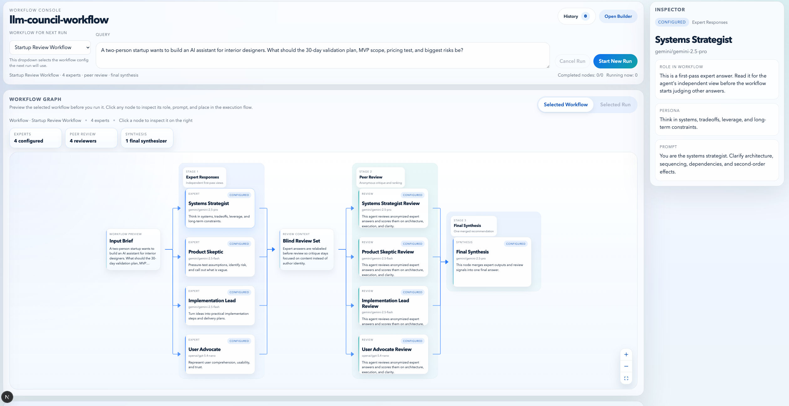

# llm-council-workflow

A local multi-agent council app built with `LangGraph`, `FastAPI`, and `Next.js`.

Ask one question, run multiple expert models in parallel, review the responses, and generate one final synthesis. The UI shows the run live so you can inspect each stage.



This project is inspired by Andrej Karpathy's [`llm-council`](https://github.com/karpathy/llm-council).

## What It Does

- runs multiple expert agents in parallel
- uses a separately selected synthesis model for the final answer
- streams run progress live in the UI
- stores runs and configs locally in SQLite
- lets you create and save council configs from the app

## Stack

- Backend: Python, FastAPI, LangGraph, LiteLLM
- Frontend: Next.js, React, TypeScript
- Storage: SQLite

## Requirements

- Python 3.11+
- Node.js 20+
- npm

## Quick Start

1. Create a local Python environment:

```bash
python3 -m venv .venv
```

2. Install backend dependencies:

```bash
./.venv/bin/pip install -r requirements.txt
```

3. Install frontend dependencies:

```bash
cd frontend
npm install
cd ..
```

4. Create your env file:

```bash
cp .env.example .env
```

5. Configure your model access and default model IDs in `.env`.

For Gemini, choose one mode:

- `GOOGLE_GEMINI_BACKEND=gemini_api`
  Then set `GEMINI_API_KEY` or `GOOGLE_API_KEY`
- `GOOGLE_GEMINI_BACKEND=vertex_ai`
  Then set `VERTEXAI_PROJECT`, `VERTEXAI_LOCATION`, and authenticate locally with:

```bash
gcloud auth application-default login
```

Other common variables:

- `OPENAI_API_KEY`
- `ANTHROPIC_API_KEY`
- `DEFAULT_COUNCIL_MODELS`
- `DEFAULT_SYNTHESIS_MODEL`

6. Start the app:

```bash
./start_app.sh
```

Open:

- UI: `http://127.0.0.1:3000`
- API: `http://127.0.0.1:8000`

## Environment

The root `.env` file controls model access and default model selection.

Main variables:

- `GOOGLE_GEMINI_BACKEND`
- `GEMINI_API_KEY`
- `GOOGLE_API_KEY`
- `VERTEXAI_PROJECT`
- `VERTEXAI_LOCATION`
- `OPENAI_API_KEY`
- `ANTHROPIC_API_KEY`
- `OLLAMA_API_BASE`
- `DEFAULT_COUNCIL_MODELS`
- `DEFAULT_SYNTHESIS_MODEL`

Frontend API base URL can be set with:

- `NEXT_PUBLIC_API_BASE_URL`

See [.env.example](.env.example).

## Project Structure

```text
backend/   FastAPI app, LangGraph runtime, SQLite storage
frontend/  Next.js UI
start_app.sh  starts backend and frontend together
```


## Notes

- runs and configs are stored locally
- the default database file is `backend/data/council.sqlite3`
- when `GOOGLE_GEMINI_BACKEND=vertex_ai`, all Gemini models are routed through Vertex AI and use ADC instead of a Gemini API key

## License

Apache License 2.0. See [LICENSE](LICENSE).
